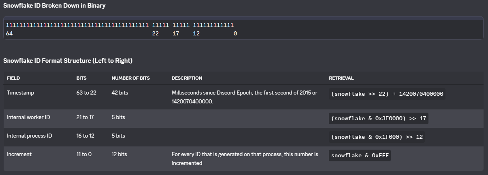

# Definitions

Outlined below are basic definitions that developers should know and understand to make the most out of `hikari` and Discord bot development.

## Gateway (Websockets)

The [Gateway](https://discord.com/developers/docs/reference#gateway-websocket-api) is Discord's websocket endpoint that gateway-specific OAuth2 applications use to communicate with Discord in the backend. Websockets are two-way TCP connections, making connections and messages to and from the gateway easy and convenient. This is the primary and recommended way to develop Discord bots. `hikari` implements this as the `GatewayBot` object.

## Guilds (Servers)

[Guilds](https://discord.com/developers/docs/resources/guild#guild-object) are commonly referred to as "servers". Discord doesn't call guilds "servers" in documentation.

## Intents

Discord outlines intents as what your bot/application **intends** on implementing and using. Most intents are unpriveleged (meaning no authorization is necessary) where some are **priveleged**, meaning Discord must manually authorize your bot to access information provided by those intents once your bot reaches a certain threshold of guilds.
A list of all publicly documented intents can be found [here](https://discord.com/developers/docs/events/gateway#list-of-intents).

## REST (HTTP)

The Discord REST API allows HTTP requests to add/update/delete objects and systems within Discord.
Most Discord objects (like guilds, channels, messages, users/members) have REST functionality (like `channel.create_message()`, etc.) implemented by `hikari`.

## Snowflakes (IDs)

[Snowflakes](https://discord.com/developers/docs/reference#snowflakes) are Discord's unique identifiers (or `ID`s). They are essentially regular integers and are treated that way by `hikari` internally.
Discord provides a diagram that shows how they are made and what specific parts of the snowflake are for.

