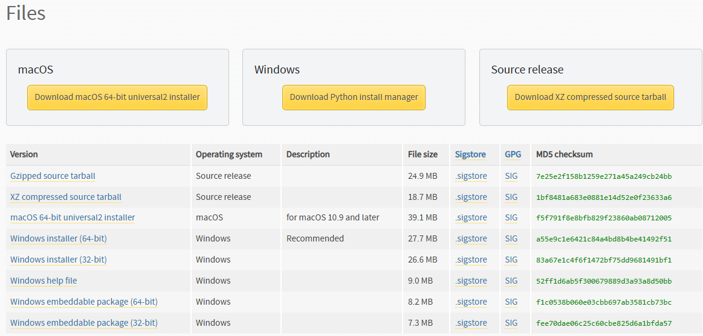
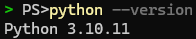
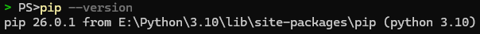
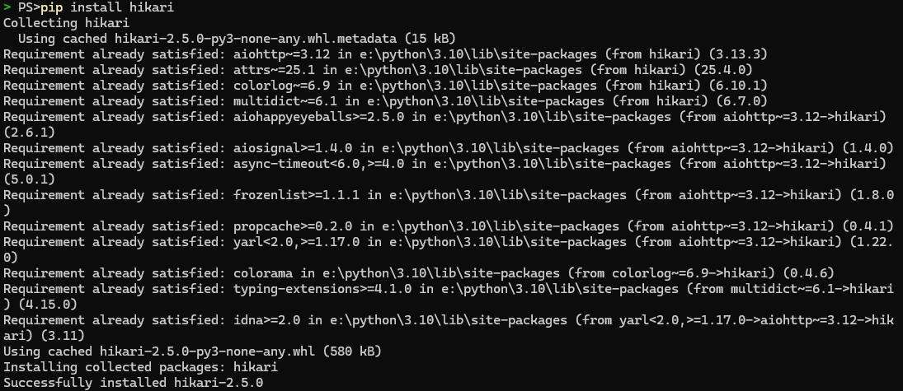

# Environment

Since `hikari` runs on `Python` `3.10+`, we need a development environment that supports our workflow.

## Installing Python

It's recommended to install the latest version of `Python` because of new optimizations and features, but we will be installing `3.10` just for example; feel free to install any future stable version that `hikari` supports.

This guide is written for a `Windows 11` with a `x64` bit architecture, but will be very easy to translate into other operating systems. The workflow is similar for `macOS` but `Linux` users may have to install via `sudo apt install`.

First, visit Python's [download](https://www.python.org/downloads/) page and look for the Python version you wish to install, and then look for the installer file for your operating system and architecture.
Since we are installing `3.10`, we need to install the pre-built binaries of `3.10.11` (the last version of `3.10` to include pre-built binaries) for simplicity.

When visiting the [3.10.11 downloads page](https://www.python.org/downloads/release/python-31011/), there should be a `Files` section at the bottom that looks like this:

Since we are using `Windows 11 x64`, we need to use the `Windows installer (64-bit)` file ([found here](https://www.python.org/ftp/python/3.10.11/python-3.10.11-amd64.exe)). Download it and run the installer. Leave the default options checked and make sure the `Add to PATH` option is checked.

Once installed, verify it installed and is in `PATH` using `python --version` in your terminal/command prompt. It should look something like this:

## Installing hikari

Since installing `Python` only installs the language itself and not `hikari`, we need to install it.
If left checked in the installer, Python's package manager, `PIP`, should be installed. If not, reinstall `Python` with `PIP` included.

You can verify that `PIP` is installed by running `pip --version` in your terminal/command prompt. It should look something like this: 

Now that `PIP` is installed, install `hikari` using it: `pip install hikari`

## Installing an IDE

An `IDE` is your Integrated Development Environment (fancy talk for your code editor).
Install the IDE of your choice, the easiest and most lightweight being `Visual Studio Code`.

A table below is provided for convenience, but `Visual Studio Code` is the only documented as of this being written.

| Name | Documented? |
|------|-------------|
| [Visual Studio Code](https://code.visualstudio.com/Download) | [Yes](visual-studio-code.md) |
| [JetBrains PyCharm](https://www.jetbrains.com/pycharm/download/) | No |
| [Sublime Text](https://www.sublimetext.com/download) | No |

Once your IDE is installed and set up, continue to [Program](../program/index.md).
