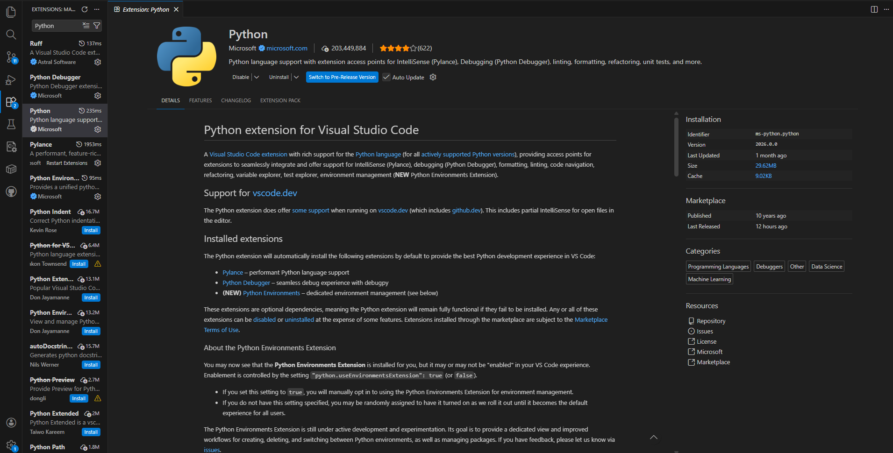
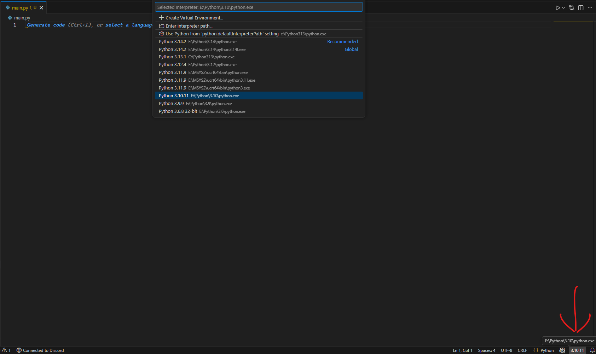

# Visual Studio Code

## Table of Contents

- [Install VSCode](#install-vscode)
- [Install Extensions](#install-extensions)
- [Selecting the Python Interpreter](#selecting-the-python-interpreter)

## Install VSCode

If you haven't already, install [Visual Studio Code](https://code.visualstudio.com/Download).

## Install Extensions

Once `VSCode` is installed, open the `Extensions` tab at the left navigation menu of the application.
Search for the `Python` extension and install it. It is published and maintained by `Microsoft` and includes `Pylance` (allowing tooltips and hints), `Python Debugger`, linting, formatting, tests, etc.

## Selecting the Python Interpreter

`Visual Studio Code` is automatically able to detect and select the proper interpreter, but sometimes fails.
When we begin to program in our `main.py` in the next page, we need to verify that the proper interpreter is selected.

It is found by looking for a Python version at the bottom right of the application when inside of a `.py` file.
Hover over it and make sure it's the Python version you installed. If not, click it and select the proper interpreter location in the pop-up instead.

When it comes time to run our program in the next page, use the `Play` button/triangle at the top right of the application to run your bot.

Once the proper interpreter is selected, you may continue to [Program](../program/index.md).
