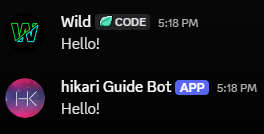

# Reply Program

In this module, we are going to reply to a user with an exact copy of the message they sent.
If a user says "Hello" the bot will say "Hello" as well.<br/>


!!! warning
    This program requires the reading of users' message contents, and this requires the `MESSAGE_CONTENT` priveleged intent. Be sure your bot's application has the `Message Content` intent set to `ENABLED` and the bot definition includes the `hikari.Intents.MESSAGE_CONTENT` intent, otherwise message content will always be `None`.

    ```python
    bot = hikari.GatewayBot(TOKEN, intents=hikari.Intents.MESSAGE_CONTENT)
    ```

It is recommended that you first read and understand [Program Setup](../program/setup.md) before continuing.

The following will listen for a message and respond with a copy of it's contents.

```python
@bot.listen()
async def message_sent(event: hikari.MessageCreateEvent) -> None:
    await event.message.respond(event.message.content)
```

First, we listen for the `MessageCreateEvent`. Once we receive this event, the bot will execute the `message_sent` function with the event itself as the first parameter (`event`).

Second, we tell the bot's REST client to create a message in the event's channel (where the original message was sent) with the contents of the event's message.

!!! warning
    If the original message is sent without content, i.e. a file was uploaded, then `event.message.content` will be `None`/empty. If we attempt the code above without a guard for this, we may get an error from Discord saying it can't make an empty message

A better way to do this is:

```python
@bot.listen()
async def message_sent(event: hikari.MessageCreateEvent) -> None:
    message: hikari.Message = event.message # Get the original message
    content: str | None = message.content # Get the message's content, if populated

    if content is None: # No content
        await message.respond("I cannot create an empty message")
        return # Return so further logic is not executed
    
    await message.respond(content) # Reply with original message's content
```

However, there is still one big issue. This listens for **all** messages created. If the bot replies with a message, another `MessageCreateEvent` is fired for the message the bot created, leading to another event being dispatched, forever. To prevent this, another guard should be added that ignores the bot's own messages.

```python
@bot.listen()
async def message_sent(event: hikari.MessageCreateEvent) -> None:
    message: hikari.Message = event.message
    content: str | None = message.content

    if content is None:
        await message.respond("I cannot create an empty message")
        return

    if message.author.id == bot.get_me().id:
        return
    
    await message.respond(content)
```

Because this requires the bot's `.get_me()` method, we need to be sure that whenever we use it, the bot is actually started/running. Otherwise, the `.get_me()` method will return `None` rather than `hikari`.`OwnUser`. If not started, then the `bot.get_me().id` will error because `None` doesn't contain the `id` property. We do not need to worry about this as non-lifetime events dispatched by `hikari` are only dispatched when the bot is running/started already. This will not be an issue for us now, but is important to know for future development. However, your IDE may complain about it if unguarded (you can implement a guard for this, but it will never execute).

!!! warning
    `hikari`'s `MessageCreateEvent` works even if the message is in DMs or in a guild.
    To separate this logic if desired, `hikari` provides `GuildMessageCreateEvent` and `DMMessageCreateEvent`.

    If you use the `GuildMessageCreateEvent`, you will also need the `GUILD_MESSAGES` intent:
    ```python
    bot = hikari.GatewayBot(TOKEN, intents=hikari.Intents.GUILD_MESSAGES | hikari.Intents.MESSAGE_CONTENT)
    ```

    If you use the basic `MessageCreateEvent`, be aware that without the `GUILD_MESSAGES` intent, you will only receive DM messages.

## Final Program

```python
import hikari

bot = hikari.GatewayBot(TOKEN, intents=hikari.Intents.MESSAGE_CONTENT)

@bot.listen()
async def message_sent(event: hikari.MessageCreateEvent) -> None:
    message: hikari.Message = event.message
    content: str | None = message.content

    if content is None:
        await message.respond("I cannot create an empty message")
        return

    if message.author.id == bot.get_me().id:
        return

    await message.respond(content)

if __name__ == "__main__":
    bot.run()
```
