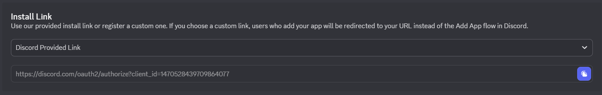

# Creating an OAuth2 application

An OAuth2 application is the foundational application that Discord bots (or any Discord app) run as.
Each application has a token that is used to identify with Discord's gateway when we wish to connect (like a password).

We need to create our OAuth2 application (bot user), set its intents, permissions (if required), and get the token.

!!! warning
    Discord may change their portal and its workflow at any time, so the steps below may change.

## Creating the Application

Visit the `Applications` page at the Discord Developer portal, found [here](https://discord.com/developers/applications).
Make sure you are signed in to the Discord account you wish to parent the Discord bot itself, then click `New Application` at the top-right of the page.

Give your application a name and the `Personal` team is fine to start. Accept the Discord Developer Terms of Service and Developer Policy, and click `Create`.

## General Information

Once the application is created, it should take you to the `General Information` page. Listed here is all information regarding your application's identity, like the name, description (profile `About Me`), tags, and install count.

The only field that needs to be filled out here is the `Description` as it covers the contents of the bot's `About Me` profile description, if you wish to have one. The username and avatar will be on the Bot page (discussed later).

Any changes made should be saved by clicking the green `Save Changes` button at the bottom of the page.

## Installation

Visit the `Installation` section at the left of the page.

There are two types of application installs: `User` and `Guild`. Usual Discord bots only need to be installed to guilds (Discord servers), so the `User Install` option should be unchecked. Only `Guild Install` should be checked.

Since we are going to implement some basic slash commands, we will need to give the `Guild Install` the `applications.commands` scope, as well as the `bot` scope so we can give the bot default permissions on invite if we so wish. If you are going to give the bot any permission with roles on the guild you install it to, default permissions are unnecessary to provide. For bots meant to be public and big, default permissions should always be included with the minimal amount of permissions for the bot to work properly.

Save your changes thus far by clicking the green `Save Changes` button at the bottom of the page.

Using the `Discord Provided Link` is perfectly fine (often preferred) for installing Discord bots to guilds, so visit the link provided and invite the bot to the server you wish (and have permission) to invite the bot to.

Once the bot has been invited to our server, we can see it in the `Offline` section of our member list.

If you wish for the bot to be public, ignore this step, otherwise this will mark the bot as private and only allow you to invite the bot to guilds.
Under the `Install Link`, set the `Discord Provided Link` to `None`.

## Bot

Visit the `Bot` section at the left of the page.

This is where the usual public details of the bot are set, like the Username, Avatar/Icon, and Banner. This also allows us to set our intents and the privacy of our bot.
Upload any avatars/icons you wish and set the username of the bot.

Get the bot's token by clicking the blurple `Reset Token` button. Copy this token and save it somewhere that you can access later, like a notepad or text document, as well will need this later. It should look something like this: `ABCdEfghIJKlmnopQrStUvWxYZ.abcDEF.aBCdefGHIjKlMNOPqrStUvWXYzABcDeFgHiJkl`.

If you wish for the bot to be private, mark the `Public Bot` as `False` (untoggled).
We will not need the `Presence Intent` as the bot will not need to be updated when a user's presence (like game activity or music) changes.
We should keep the `Server Members Intent` and `Message Content Intent` toggled because we need to receive updates when members join/leave our guild or when messages are sent and we wish to read the contents of such message.

Save your changes thus far by clicking the green `Save Changes` button at the bottom of the page.

If you already have your `Python` environment set up (`hikari` installed, IDE installed) skip to [Program](program/index.md).

Now that our OAuth2 application as been created, proceed to setting up the [Environment](environment/index.md).
