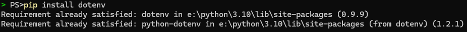

# Security

OAuth2 application **tokens** are supposed to be **stored securely**. Earlier we mentioned to note our OAuth2 application token somewhere, and pasting in our `main.py` file for access in the program is dangerous and unsecure.

Environment variables are our friend here, because not only do we not have to paste in those values in our program directly, there are also packages that will load a file into our environment variables, and if the project is shared on a repository like Git, a `.gitignore` can ignore that file from distribution, leading secrets (such as our token) to not be shared and our program to be seen without security compromises.

## Install dotenv

`dotenv` is a `Python` package that will take any environment file (like `.env`) and load it into our program's environment variables.

Install `dotenv` using `pip install dotenv`.<br/>


## Import and Initialize

We need to tell the `Python` interpreter that we wish to use `dotenv`'s `load_dotenv` and `os`. `load_dotenv` initializes and loads our `.env` file into our environment variables.
The `os` module will be needed to access our environment variables.

```python
# main.py
from dotenv import load_dotenv

import os

load_dotenv()

TOKEN: str = os.environ["TOKEN"]
```

```python
# .env
TOKEN="PASTE_YOUR_TOKEN_HERE"
```

## Final Program

A finalized, secure bot setup would look something like this. Do note the actual implementation of the bot is discussed in [Setup](setup.md).

```python
from dotenv import load_dotenv

import hikari
import os

load_dotenv()

TOKEN: str = os.environ["TOKEN"]

bot = hikari.GatewayBot(TOKEN)

...

bot.run()
```